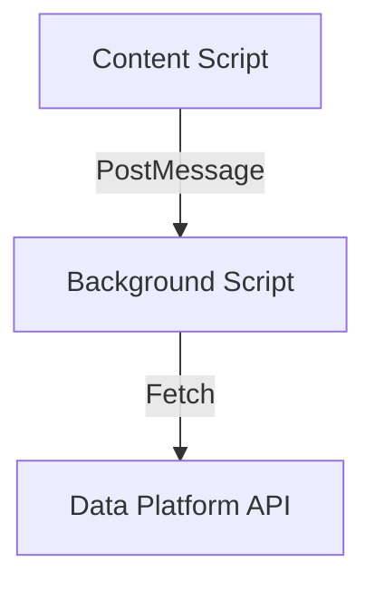
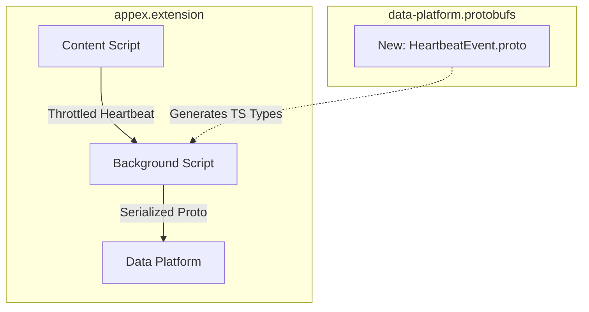

# High-Level Strategy

We need to implement a throttled heartbeat mechanism in the `content-script` that triggers on user interaction. This data must be serialized using a new Protobuf message definition and sent through the `background-script` to the Nexthink Data Platform.

# Dependency Order

1. [x] **Protobuf/Schema changes**: Define `HeartbeatEvent` in `data-platform.protobufs`.
2. [ ] **Extension Implementation**: Update `appex.extension` to handle the new message passing and background relay.

# Diagrams

## Current Architecture

## Proposed Changes

# Impact Checklist

- [x] **Manifest Permissions**: No new permissions required (uses existing webRequest).
- [x] **State/Store**: Update `sessionSlice.ts` to track the last heartbeat timestamp.
- [ ] **Cross-Context Messaging**: New message type `SEND_HEARTBEAT` added to `InternalMessage` enum.

# Implementation Plan

- [ ] **Protobufs**: Add `HeartbeatEvent` with `timestamp` and `page_url` fields.
- [ ] **Content Script**: Implement `ActivityMonitor.ts` using `lodash.throttle`.
- [ ] **Background Script**: Add listener for `SEND_HEARTBEAT` and integrate with `ProtobufService`.
- [ ] **State**: Update store to prevent redundant heartbeats if the tab is inactive.

# Affected Files (Probable)

- `~/Work/data-platform.protobufs/events/heartbeat.proto`
- `~/Work/appex.extension/src/content/ActivityMonitor.ts`
- `~/Work/appex.extension/src/background/messaging/HeartbeatHandler.ts`
- `~/Work/appex.extension/src/shared/store/sessionSlice.ts`

# Testing & QA

## Unit Tests

- [ ] `ActivityMonitor` should not fire more than once every 30 seconds.
- [ ] `ProtobufService` should correctly encode the `HeartbeatEvent`.

## Playwright (Component/E2E)

- [ ] **Mocks Required**: Intercept `POST /api/v1/heartbeat` and return `200 OK`.
- [ ] **Test Cases**:
  - Verify heartbeat fires on scroll or click.
  - Verify heartbeat does not fire when the tab is hidden (Page Visibility API).
