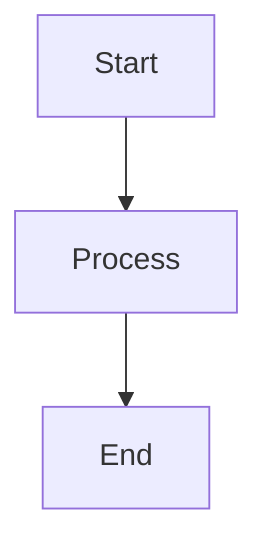

# create-markdown

Write markdown following a consistent style guide. Works for any markdown — docs, READMEs, notes, blog posts, guides.

When writing for `@san-siva/blogkit-md`, also apply the blogkit-specific rules in the section below.

## Steps

1. Ask the user what they want to write (topic, title, brief outline) if not already provided.
2. Ask if this is for blogkit-md or general markdown.
3. Draft the markdown following the style guide below.
4. Show the result and ask if they'd like any adjustments.

## General Style Guide

### Headings

- Use `#` for the document title (one per file).
- Use `##` for major sections, `###` for subsections.
- Don't skip levels (e.g. `##` → `####`).
- Keep headings short and scannable.
- **No numbers in `#`, `##`, or `###` headings.** Numbers are only allowed in `####` and deeper headings, or in ordered lists.

### Frontmatter

Use YAML frontmatter when metadata is needed:

```markdown
---
title: Your Title
description: A short description.
---
```

### Callouts

GitHub-style blockquote alerts:

```markdown
> [!NOTE]
>
> Something the reader should know.

> [!TIP]
>
> A helpful suggestion.

> [!IMPORTANT]
>
> Critical information.

> [!WARNING]
>
> Something that could go wrong.

> [!CAUTION]
>
> A danger or destructive action.
```

The blank `>` line between the type and content is required.

### Code Blocks

Always specify the language:

````markdown
```typescript
const x: string = 'hello';
```

```bash
npm install my-package
```

```json
{ "key": "value" }
```
````

### Mermaid Diagrams

````markdown

````

### Tables

```markdown
| Column A | Column B | Column C |
| -------- | -------- | -------- |
| value    | value    | value    |
```

- **Never use any text-formatting syntax in table headers** — no code spans (backticks), no `**bold**`, no `_italic_`. They don't render properly in header cells. Write headers as plain text only (e.g. use `Flag`, not `` `--flag` `` or `**Flag**`). Formatting like `` `code` `` is fine in body cells.

### Task Lists

```markdown
- [x] Completed item
- [ ] Pending item
```

### Inline Formatting

| Syntax        | Use                              |
| ------------- | -------------------------------- |
| `**bold**`    | Emphasis, key terms              |
| `_italic_`    | Titles, subtle emphasis          |
| `` `code` ``  | Inline code, commands, filenames |
| `[text](url)` | Links                            |
| `` | Images                           |

### Horizontal rules are banned

**Never emit a horizontal rule to separate sections.** This applies to every horizontal-rule syntax — `---`, `***`, `___`, or any line of three-or-more `-`/`*`/`_` on its own. There are exactly two valid uses of `---` in a document, and nothing else:

1. The opening and closing fences of a YAML frontmatter block at the very top of the file.
2. The dashes inside a table's header-separator row (e.g. `| ---- | ---- |`).

To break up content, use a heading (`##`, `###`) — never a rule. If you are about to write a `---` line that is not one of the two cases above, delete it and add a heading or just a blank line instead.

### General Writing Tips

- Prefer callouts over parenthetical asides for important notes.
- Use code blocks liberally for any technical content.
- Keep paragraphs concise — one idea per paragraph.
- Use lists for three or more related items rather than inline prose.

## blogkit-md Rules

Apply these **in addition** to the general guide when writing for `@san-siva/blogkit-md`.

### Frontmatter

`title` and `description` are both required:

```markdown
---
title: Your Post Title
description: A short, one or two sentence description shown below the title.
---
```

- Do NOT add an `#` H1 — it would be stripped when frontmatter title is present.

### Heading Hierarchy

| Level                   | Purpose                     | Layout effect                           |
| ----------------------- | --------------------------- | --------------------------------------- |
| `##`                    | Major section               | Creates a new `BlogSection`             |
| `###`                   | Subsection within a section | Creates a nested subsection             |
| `####` `#####` `######` | Minor headings              | Rendered as bold text, no layout change |

- Content before the first `##` becomes an untitled intro section — keep it short (2–4 sentences).
- Don't use section separators (`---`) — they are handled automatically.
