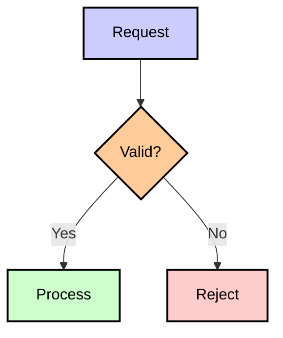
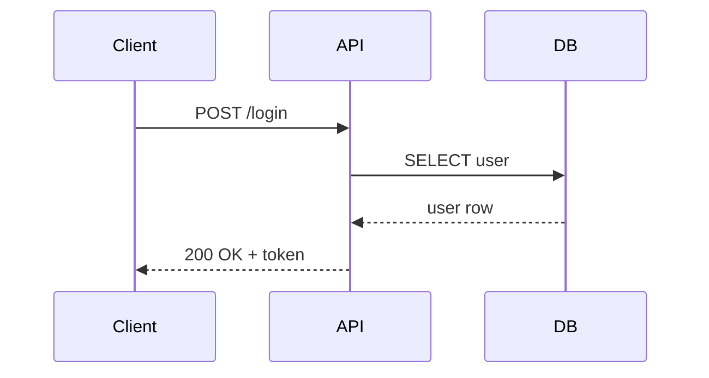

# Mermaid Syntax Guide

## General Rules

- All node IDs must be **unique** within the diagram.
- Never use reserved words as node IDs or labels: `end`, `graph`, `subgraph`, `style`, `class`, `click`, `direction`, `participant`, `as`, `loop`, `alt`, `opt`, `par`, `and`, `note`, `rect`, `over`, `left`, `right`, `of`.
- Wrap reserved words in quotes if they must appear in labels: `A["end state"]`.
- Avoid spaces in node IDs — use camelCase or underscores: `myNode`, `my_node`.
- Always wrap output in ` ```mermaid ` ... ` ``` ` fenced blocks.

## Node Shapes

Each shape conveys a different semantic meaning. Choose the shape that best represents the node's role in the diagram.

| Shape         | Syntax       | Use for                                        |
| ------------- | ------------ | ---------------------------------------------- |
| Rectangle     | `A[Label]`   | Generic step or action                         |
| Rounded rect  | `A(Label)`   | Start / end of a flow                          |
| Stadium       | `A([Label])` | Terminal node or external trigger              |
| Cylinder (DB) | `A[(Label)]` | Database, persistent store, or in-memory cache |
| Diamond       | `A{Label}`   | Decision / branching condition                 |
| Hexagon       | `A{{Label}}` | Preparation or configuration step              |
| Parallelogram | `A[/Label/]` | Input / output                                 |
| Circle        | `A((Label))` | Event or connector                             |

### Edge types

| Type          | Syntax        |
| ------------- | ------------- |
| Arrow         | `-->`         |
| Open link     | `---`         |
| Dotted arrow  | `.-.->`       |
| Thick arrow   | `==>`         |
| Label on edge | `-->\|text\|` |

### Subgraphs

```
subgraph GroupName
    A --> B
end
```

- Subgraph IDs must also be unique.
- Do not name a subgraph `end`.

### Styling

```
style NodeID fill:#f9f,stroke:#333,stroke-width:2px
classDef className fill:#fff,stroke:#000
class NodeID className
```

### Standard Color Classes

Use these predefined classes for consistent, readable diagrams:

```
classDef green fill:#ccffcc,stroke:#000,stroke-width:2px,color:#000000;
classDef red fill:#ffcccc,stroke:#000,stroke-width:2px,color:#000000;
classDef blue fill:#ccccff,stroke:#000,stroke-width:2px,color:#000000;
classDef orange fill:#ffcc99,stroke:#000,stroke-width:2px,color:#000000;
```

| Class    | Use for                                                                  |
| -------- | ------------------------------------------------------------------------ |
| `green`  | Success states, healthy services, approvals, **new nodes in a diff diagram** |
| `red`    | Error states, failures, rejections, removals or deletions                |
| `blue`   | Primary services, entry points, user-facing                              |
| `orange` | Warnings, intermediate states, in-progress, change                       |

> **Convention:** In "before vs after" or "proposed changes" diagrams, always apply `:::green` to every new node so readers can immediately spot additions.

Apply with `class NodeID className` (single) or `class NodeA,NodeB className` (multiple):



> **Tip:** You can also apply a class inline using `:::` syntax: `NodeID[Label]:::className`

---

## Sequence Diagram



### Arrow types

| Type        | Syntax | Meaning              |
| ----------- | ------ | -------------------- |
| Solid       | `->>`  | Synchronous call     |
| Dotted      | `-->>` | Response / async     |
| Solid open  | `->`   | No arrowhead         |
| Dotted open | `-->`  | No arrowhead, dashed |

### Grouping

```
loop Every 5s
    A->>B: Heartbeat
end

alt Success
    A->>B: OK
else Failure
    A->>B: Error
end

opt Optional flow
    A->>B: Maybe
end
```

### Notes

```
Note over A,B: Some note spanning two participants
Note right of A: Note on one side
```

## Common Pitfalls & Fixes

| Problem                                        | Fix                                                                 |
| ---------------------------------------------- | ------------------------------------------------------------------- |
| Node label contains `(` or `)`                 | Wrap in quotes: `A["label (note)"]`                                 |
| Edge label breaks rendering                    | Use `\|text\|` or avoid special chars                               |
| Subgraph named `end`                           | Rename to `EndGroup` or `Finish`                                    |
| Duplicate node IDs                             | Suffix with index: `svc1`, `svc2`                                   |
| `graph` used as a node ID                      | Rename to `g` or `graphNode`                                        |
| Flowchart direction ignored                    | Declare at top: `graph LR` or `graph TD`                            |
| Subgraph ID contains hyphens                   | Use camelCase: `serviceWorker` not `service-worker`                 |
| Subgraph title wrapped in quotes               | Title must be bare text: `subgraph id [My Title]` not `["My Title"]`|
| Unicode arrows in node labels (`→`, `⬅`, etc.) | Use plain ASCII: `-` or descriptive text instead                    |
| Dotted edge with inline label `-.text.->`      | Use `-.->|text|` instead                                            |
| Edge label contains `/`                        | Replace with a space or word: `A and B` not `A / B`                 |

## Direction Reference

| Keyword | Direction    | Best for                    |
| ------- | ------------ | --------------------------- |
| `TD`    | Top → Down   | Hierarchies, trees          |
| `LR`    | Left → Right | Processes, pipelines        |
| `BT`    | Bottom → Top | (rare) inverted hierarchies |
| `RL`    | Right → Left | (rare) mirrored pipelines   |
